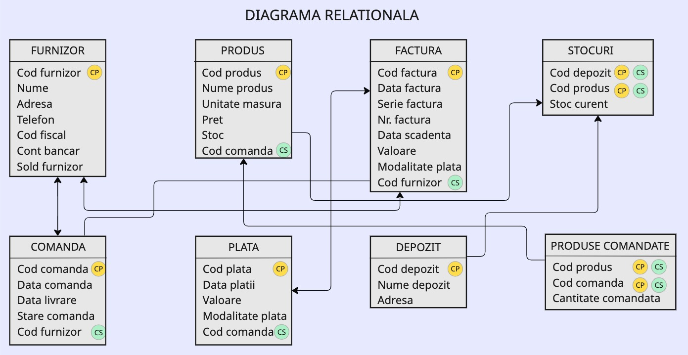
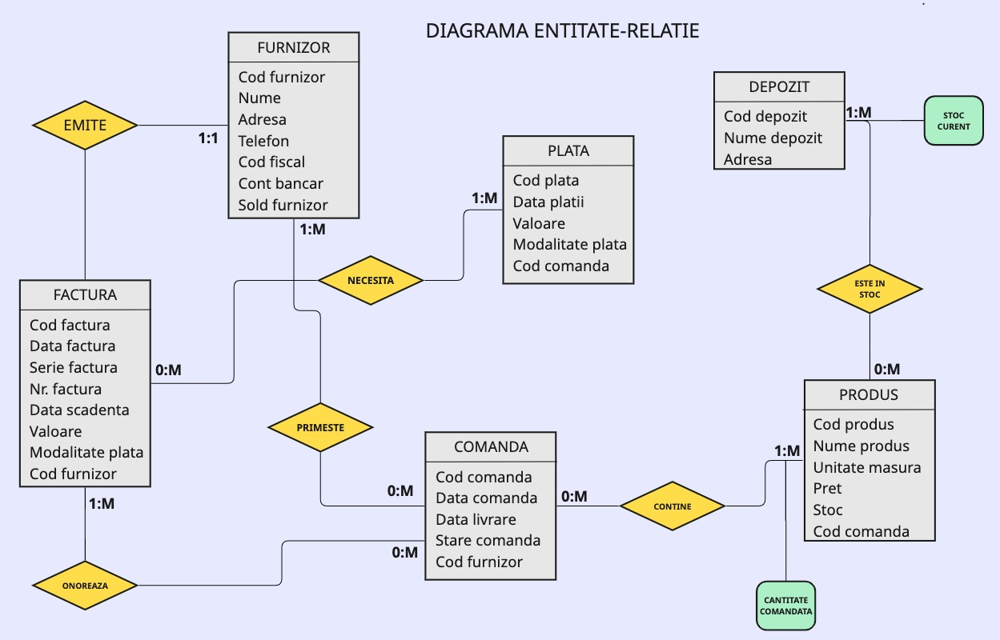
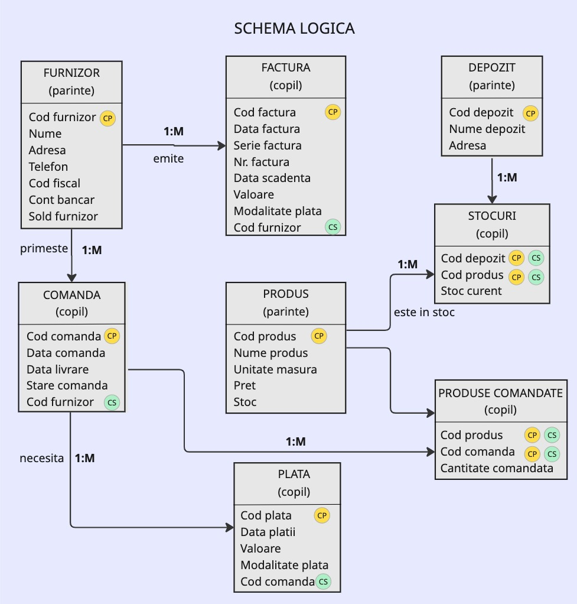

# Documentație Bază de Date ContApp

## Structura Bazei de Date și Ghid de Utilizare pgAdmin

### Cuprins

1. [Introducere](#introducere)
2. [Schema Bazei de Date](#schema-bazei-de-date)
   - [Diagrama Relațională](#diagrama-relațională)
   - [Diagrama Entitate-Relație](#diagrama-entitate-relație)
   - [Schema Logică](#schema-logică)
3. [Descrierea Tabelelor](#descrierea-tabelelor)
4. [Relații între Tabele](#relații-între-tabele)
5. [Accesarea și Gestionarea Bazei de Date cu pgAdmin](#accesarea-și-gestionarea-bazei-de-date-cu-pgadmin)
   - [Conectarea la Baza de Date](#conectarea-la-baza-de-date)
   - [Explorarea Tabelelor](#explorarea-tabelelor)
   - [Executarea Interogărilor SQL](#executarea-interogărilor-sql)
   - [Exportul și Importul Datelor](#exportul-și-importul-datelor)
   - [Realizarea Copiilor de Siguranță](#realizarea-copiilor-de-siguranță)
6. [Exemple de Interogări Utile](#exemple-de-interogări-utile)
7. [Întreținerea Bazei de Date](#întreținerea-bazei-de-date)

## Introducere

Aplicația ContApp utilizează o bază de date PostgreSQL relațională pentru a stoca toate informațiile necesare gestionării contabilității. Structura bazei de date a fost proiectată pentru a asigura integritatea datelor, performanța și scalabilitatea aplicației.

Datele sunt organizate în tabele interconectate prin relații de tip "cheie primară - cheie străină", formând un model de date normalizat care previne redundanța și asigură consistența informațiilor stocate.

## Schema Bazei de Date

Baza de date `contapp` conține următoarele tabele principale:

- `clienti` - Informații despre clienți
- `furnizori` - Informații despre furnizori
- `categorii_produse_cheltuieli` - Categorii pentru produse și cheltuieli
- `produse` - Catalogul de produse și servicii
- `facturi` - Facturile emise către clienți
- `detalii_facturi` - Liniile de produse din facturi
- `facturi_primite` - Facturile primite de la furnizori
- `miscari_stoc` - Mișcările de stoc (intrări, ieșiri, ajustări)

### Proiecție de Dezvoltare Viitoare

Pentru o versiune viitoare a sistemului, se are în vedere extinderea și îmbunătățirea bazei de date conform următoarelor diagrame:

#### Diagrama Relațională



Diagrama relațională de mai sus prezintă o structură extinsă a bazei de date, care urmează să fie implementată în versiunile următoare ale aplicației. Aceasta include entități suplimentare pentru furnizori, produse, facturi, comenzi, plăți, depozite și stocuri. Cheile primare (CP) și cheile străine (CS) sunt evidențiate pentru a ilustra relațiile dintre tabele.

#### Diagrama Entitate-Relație



Diagrama entitate-relație ilustrează legăturile logice dintre diferitele entități din viitorul sistem și cardinalitatea acestora (1:1, 1:M, 0:M). Relațiile cheie care vor fi implementate includ:
- Furnizor EMITE Factură (1:1)
- Furnizor PRIMEȘTE Comandă (1:M)
- Comandă NECESITĂ Plată (1:M)
- Produs ESTE ÎN STOC Depozit (0:M)
- Comandă CONȚINE Produs (1:M)

#### Schema Logică



Schema logică detaliază entitățile planificate ca tabele parentale și copii, cu relațiile specificate explicit între acestea (emite, primește, necesită, este în stoc, etc.). Această reprezentare va ghida dezvoltarea viitoare a aplicației, ajutând la înțelegerea fluxului de date și a dependențelor dintre componentele sistemului.

Aceste diagrame reprezintă o extindere planificată a actualei baze de date `contapp` și vor fi implementate treptat în versiunile viitoare ale aplicației.

## Descrierea Tabelelor

### Tabelul `clienti`

Stochează informațiile despre clienții companiei.

| Coloană | Tip | Descriere |
|---------|-----|-----------|
| id | Integer | Identificator unic (cheie primară) |
| nume | String(100) | Denumirea clientului |
| cui | String(20) | Codul Unic de Identificare (CUI/CIF) |
| adresa | String(255) | Adresa clientului |
| oras | String(100) | Orașul |
| judet | String(100) | Județul |
| telefon | String(20) | Număr de telefon |
| email | String(100) | Adresa de email |
| data_adaugare | DateTime | Data adăugării în sistem |
| activ | Boolean | Indicator pentru starea clientului |

### Tabelul `furnizori`

Stochează informațiile despre furnizorii companiei.

| Coloană | Tip | Descriere |
|---------|-----|-----------|
| id | Integer | Identificator unic (cheie primară) |
| nume | String(100) | Denumirea furnizorului |
| cui | String(20) | Codul Unic de Identificare (CUI/CIF) |
| adresa | String(255) | Adresa furnizorului |
| oras | String(100) | Orașul |
| judet | String(100) | Județul |
| telefon | String(20) | Număr de telefon |
| email | String(100) | Adresa de email |
| data_adaugare | DateTime | Data adăugării în sistem |
| activ | Boolean | Indicator pentru starea furnizorului |

### Tabelul `categorii_produse_cheltuieli`

Categorii pentru produse și cheltuieli pentru o mai bună organizare.

| Coloană | Tip | Descriere |
|---------|-----|-----------|
| id | Integer | Identificator unic (cheie primară) |
| nume | String(100) | Denumirea categoriei |
| descriere | Text | Descrierea categoriei |

### Tabelul `produse`

Catalogul de produse și servicii oferite sau achiziționate.

| Coloană | Tip | Descriere |
|---------|-----|-----------|
| id | Integer | Identificator unic (cheie primară) |
| cod | String(20) | Codul produsului (unic) |
| nume | String(100) | Denumirea produsului |
| descriere | Text | Descrierea produsului |
| pret_achizitie | Numeric(10,2) | Prețul de achiziție |
| pret_vanzare | Numeric(10,2) | Prețul de vânzare |
| stoc | Integer | Cantitatea disponibilă în stoc |
| unitate_masura | String(20) | Unitatea de măsură (buc, kg, etc.) |
| tva | Integer | Cota de TVA aplicabilă (%) |
| data_adaugare | DateTime | Data adăugării în sistem |
| activ | Boolean | Indicator pentru starea produsului |
| categorie_id | Integer | Legătura cu tabela categorii (cheie străină) |
| furnizor_id | Integer | Legătura cu tabela furnizori (cheie străină) |

### Tabelul `facturi`

Facturile emise către clienți.

| Coloană | Tip | Descriere |
|---------|-----|-----------|
| id | Integer | Identificator unic (cheie primară) |
| serie | String(10) | Seria facturii |
| numar | Integer | Numărul facturii |
| data_emitere | Date | Data emiterii facturii |
| data_scadenta | Date | Data scadenței pentru plată |
| valoare_totala | Numeric(10,2) | Valoarea totală a facturii (cu TVA) |
| valoare_tva | Numeric(10,2) | Valoarea TVA-ului |
| achitata | Boolean | Indicator pentru starea plății |
| metoda_plata | String(50) | Metoda de plată |
| observatii | Text | Observații sau note |
| client_id | Integer | Legătura cu tabela clienți (cheie străină) |

### Tabelul `detalii_facturi`

Liniile individuale de produse din facturi.

| Coloană | Tip | Descriere |
|---------|-----|-----------|
| id | Integer | Identificator unic (cheie primară) |
| cantitate | Integer | Cantitatea produsului |
| pret_unitar | Numeric(10,2) | Prețul unitar |
| valoare | Numeric(10,2) | Valoarea totală a liniei (fără TVA) |
| tva | Integer | Cota de TVA aplicată (%) |
| valoare_tva | Numeric(10,2) | Valoarea TVA-ului |
| factura_id | Integer | Legătura cu tabela facturi (cheie străină) |
| produs_id | Integer | Legătura cu tabela produse (cheie străină) |

### Tabelul `facturi_primite`

Facturile primite de la furnizori.

| Coloană | Tip | Descriere |
|---------|-----|-----------|
| id | Integer | Identificator unic (cheie primară) |
| serie | String(10) | Seria facturii |
| numar | String(20) | Numărul facturii |
| data_emitere | Date | Data emiterii facturii |
| data_scadenta | Date | Data scadenței pentru plată |
| valoare_totala | Numeric(10,2) | Valoarea totală a facturii (cu TVA) |
| valoare_tva | Numeric(10,2) | Valoarea TVA-ului |
| achitata | Boolean | Indicator pentru starea plății |
| metoda_plata | String(50) | Metoda de plată |
| observatii | Text | Observații sau note |
| furnizor_id | Integer | Legătura cu tabela furnizori (cheie străină) |

### Tabelul `miscari_stoc`

Evidența mișcărilor de stoc (intrări, ieșiri, ajustări).

| Coloană | Tip | Descriere |
|---------|-----|-----------|
| id | Integer | Identificator unic (cheie primară) |
| data | DateTime | Data mișcării |
| tip | String(20) | Tipul mișcării (intrare, ieșire, ajustare) |
| cantitate | Integer | Cantitatea |
| motiv | String(255) | Motivul sau descrierea mișcării |
| produs_id | Integer | Legătura cu tabela produse (cheie străină) |
| factura_id | Integer | Legătura cu tabela facturi (cheie străină, opțional) |
| factura_primita_id | Integer | Legătura cu tabela facturi_primite (cheie străină, opțional) |

## Relații între Tabele

Schema bazei de date este organizată cu următoarele relații între tabele:

1. **Client - Factură**: Relație de tip One-to-Many. Un client poate avea mai multe facturi, dar o factură aparține unui singur client.

2. **Furnizor - Factură Primită**: Relație de tip One-to-Many. Un furnizor poate avea mai multe facturi primite, dar o factură primită aparține unui singur furnizor.

3. **Categorie - Produs**: Relație de tip One-to-Many. O categorie poate conține mai multe produse, dar un produs aparține unei singure categorii.

4. **Furnizor - Produs**: Relație de tip One-to-Many. Un furnizor poate oferi mai multe produse, dar un produs este asociat cu un singur furnizor.

5. **Factură - Detalii Factură**: Relație de tip One-to-Many. O factură poate conține mai multe linii de detalii, dar o linie de detalii aparține unei singure facturi.

6. **Produs - Detalii Factură**: Relație de tip One-to-Many. Un produs poate apărea în mai multe linii de detalii, dar o linie de detalii se referă la un singur produs.

7. **Produs - Mișcare Stoc**: Relație de tip One-to-Many. Un produs poate avea mai multe mișcări în stoc, dar o mișcare de stoc se referă la un singur produs.

8. **Factură - Mișcare Stoc**: Relație de tip One-to-Many. O factură poate genera mai multe mișcări în stoc, dar o mișcare de stoc poate fi asociată cu o singură factură.

9. **Factură Primită - Mișcare Stoc**: Relație de tip One-to-Many. O factură primită poate genera mai multe mișcări în stoc, dar o mișcare de stoc poate fi asociată cu o singură factură primită.

## Accesarea și Gestionarea Bazei de Date cu pgAdmin

pgAdmin este o platformă de administrare și dezvoltare open-source pentru PostgreSQL. Oferă o interfață grafică care simplifică crearea, întreținerea și utilizarea obiectelor bazei de date.

### Conectarea la Baza de Date

1. **Accesați pgAdmin**: Deschideți pgAdmin în browser la adresa configurată

2. **Autentificați-vă**: Folosiți credențialele furnizate de administratorul pgAdmin.

3. **Creați o Conexiune Nouă la Server**:
   - În panoul din stânga, faceți clic dreapta pe "Servers" și selectați "Create" > "Server...".
   - În tab-ul "General", introduceți un nume pentru conexiune (ex: "ContApp Local").
   - În tab-ul "Connection", completați:
     - Host name/address: localhost (sau IP-ul serverului)
     - Port: 5432 (portul implicit PostgreSQL)
     - Maintenance database: postgres
     - Username: contapp_user
     - Password: YOUR_PASSWORD_HERE

4. **Conectare la Baza de Date**:
   - După conectare, navigați la: Servers > ContApp Local > Databases > contapp

### Explorarea Tabelelor

1. **Vizualizarea Structurii Tabelelor**:
   - Navigați la: Servers > ContApp Local > Databases > contapp > Schemas > public > Tables
   - Faceți clic dreapta pe un tabel și selectați "Properties" pentru a vedea structura sa

2. **Vizualizarea Datelor**:
   - Faceți clic dreapta pe un tabel și selectați "View/Edit Data" > "All Rows"
   - Alternativ, puteți selecta "View/Edit Data" > "First 100 Rows" pentru a vedea doar primele 100 de înregistrări

3. **Explorarea Relațiilor**:
   - Pentru a vizualiza relațiile, faceți clic dreapta pe un tabel și selectați "Properties"
   - Navigați la tab-ul "Constraints" pentru a vedea cheile primare și străine

### Executarea Interogărilor SQL

1. **Deschiderea Editorului SQL**:
   - Faceți clic pe butonul "Query Tool" din bara de instrumente sau
   - Faceți clic dreapta pe baza de date "contapp" și selectați "Query Tool"

2. **Scrierea și Executarea Interogărilor**:
   - Scrieți interogarea SQL în editor
   - Executați interogarea prin apăsarea butonului "Execute/Refresh" (F5) sau apăsați F5
   - Rezultatele vor fi afișate în panoul inferior

3. **Salvarea Interogărilor**:
   - Puteți salva interogările frecvent utilizate pentru a le refolosi
   - Faceți clic pe butonul "Save" din bara de instrumente a editorului

### Exportul și Importul Datelor

1. **Exportul Datelor**:
   - Faceți clic dreapta pe un tabel și selectați "Import/Export Data..."
   - Selectați "Export" și alegeți formatul (CSV, TXT, etc.)
   - Completați opțiunile și apăsați "OK"

2. **Importul Datelor**:
   - Faceți clic dreapta pe un tabel și selectați "Import/Export Data..."
   - Selectați "Import" și alegeți fișierul sursă
   - Completați opțiunile de import și apăsați "OK"

### Realizarea Copiilor de Siguranță

1. **Backup Complet al Bazei de Date**:
   - Faceți clic dreapta pe baza de date "contapp" și selectați "Backup..."
   - Configurați opțiunile de backup și selectați locația fișierului
   - Apăsați "Backup" pentru a crea copia de siguranță

2. **Restaurarea Bazei de Date**:
   - Faceți clic dreapta pe baza de date "contapp" și selectați "Restore..."
   - Selectați fișierul de backup și configurați opțiunile de restaurare
   - Apăsați "Restore" pentru a restaura baza de date

## Exemple de Interogări Utile

### 1. Vizualizarea tuturor facturilor cu detaliile clientului

```sql
SELECT f.id, f.serie, f.numar, f.data_emitere, f.valoare_totala, 
       c.nume as client, c.cui
FROM facturi f
JOIN clienti c ON f.client_id = c.id
ORDER BY f.data_emitere DESC;
```

### 2. Vizualizarea produselor cu stoc redus (sub 10 unități)

```sql
SELECT p.cod, p.nume, p.stoc, p.unitate_masura, c.nume as categorie
FROM produse p
LEFT JOIN categorii_produse_cheltuieli c ON p.categorie_id = c.id
WHERE p.stoc < 10 AND p.activ = true
ORDER BY p.stoc ASC;
```

### 3. Raport de vânzări pe lună

```sql
SELECT 
    EXTRACT(YEAR FROM data_emitere) as an,
    EXTRACT(MONTH FROM data_emitere) as luna,
    SUM(valoare_totala - valoare_tva) as suma_neta,
    SUM(valoare_tva) as suma_tva,
    SUM(valoare_totala) as suma_totala,
    COUNT(*) as numar_facturi
FROM facturi
GROUP BY an, luna
ORDER BY an DESC, luna DESC;
```

### 4. Facturile neachitate cu termenul depășit

```sql
SELECT f.id, f.serie, f.numar, f.data_emitere, f.data_scadenta, 
       f.valoare_totala, c.nume as client
FROM facturi f
JOIN clienti c ON f.client_id = c.id
WHERE f.achitata = false AND f.data_scadenta < CURRENT_DATE
ORDER BY f.data_scadenta ASC;
```

### 5. Analiza vânzărilor pe categorii de produse

```sql
SELECT 
    c.nume as categorie,
    SUM(d.valoare) as valoare_neta,
    SUM(d.valoare_tva) as valoare_tva,
    SUM(d.valoare + d.valoare_tva) as valoare_totala
FROM detalii_facturi d
JOIN produse p ON d.produs_id = p.id
LEFT JOIN categorii_produse_cheltuieli c ON p.categorie_id = c.id
JOIN facturi f ON d.factura_id = f.id
WHERE f.data_emitere BETWEEN '2025-01-01' AND '2025-12-31'
GROUP BY c.nume
ORDER BY valoare_totala DESC;
```

## Întreținerea Bazei de Date

Pentru a asigura performanța optimă și integritatea datelor, se recomandă efectuarea periodică a următoarelor operațiuni de întreținere:

### 1. Vacuum și Analiză

Operațiunea VACUUM recuperează spațiul ocupat de înregistrările șterse și actualizează statisticile utilizate de planificatorul de interogări.

```sql
VACUUM ANALYZE;
```

### 2. Reindexare

Reindexarea reconstruiește indexurile, care pot deveni fragmentate în timp.

```sql
REINDEX DATABASE contapp;
```

### 3. Verificarea Integrității

Pentru a verifica integritatea relațională a bazei de date:

```sql
-- Verifică dacă există înregistrări în detalii_facturi fără o factură corespunzătoare
SELECT * FROM detalii_facturi 
WHERE factura_id NOT IN (SELECT id FROM facturi);

-- Verifică dacă există înregistrări în detalii_facturi fără un produs corespunzător
SELECT * FROM detalii_facturi 
WHERE produs_id NOT IN (SELECT id FROM produse);
```

### 4. Backup Regulat

Se recomandă efectuarea de backup-uri regulate ale bazei de date, folosind fie pgAdmin, fie comanda pg_dump:

```bash
pg_dump -U contapp_user -W -F c -b -v -f contapp_backup_$(date +%Y%m%d).backup contapp
```

Pentru mai multe informații despre PostgreSQL și pgAdmin, consultați documentația oficială:
- [Documentație PostgreSQL](https://www.postgresql.org/docs/)
- [Documentație pgAdmin](https://www.pgadmin.org/docs/)